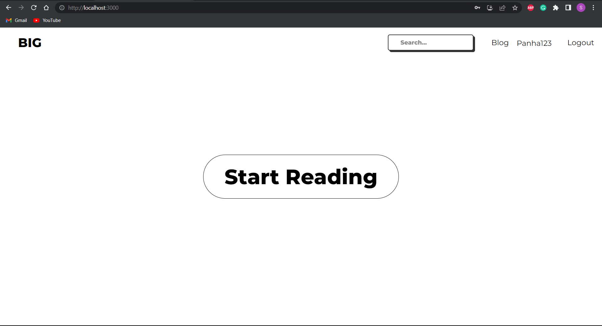
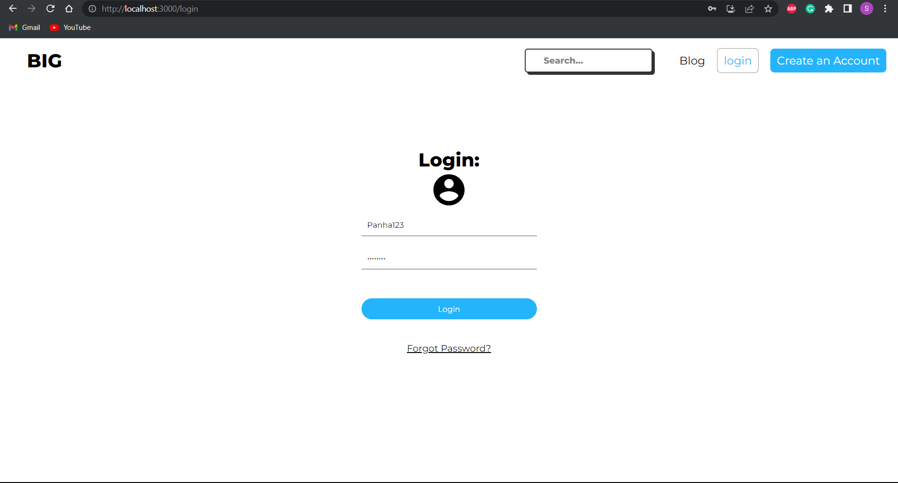
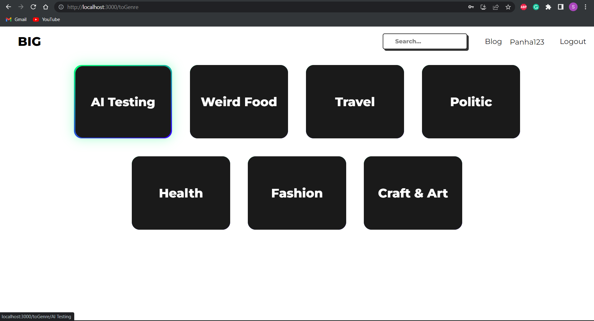
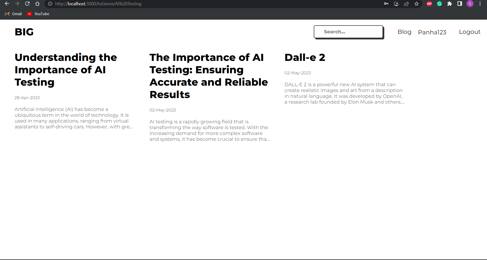
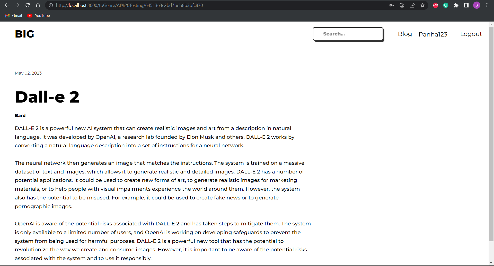
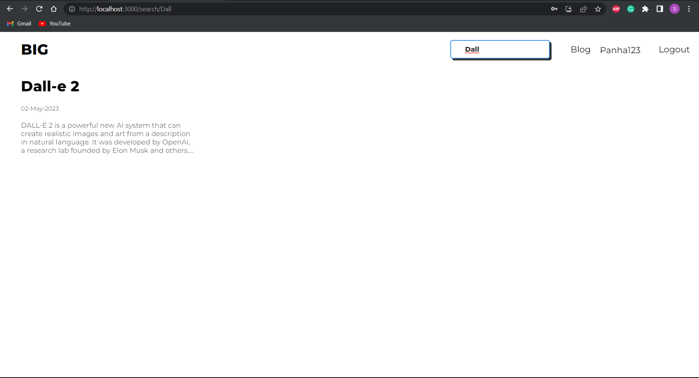
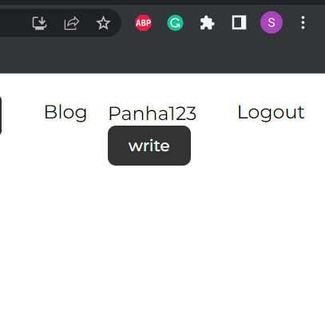
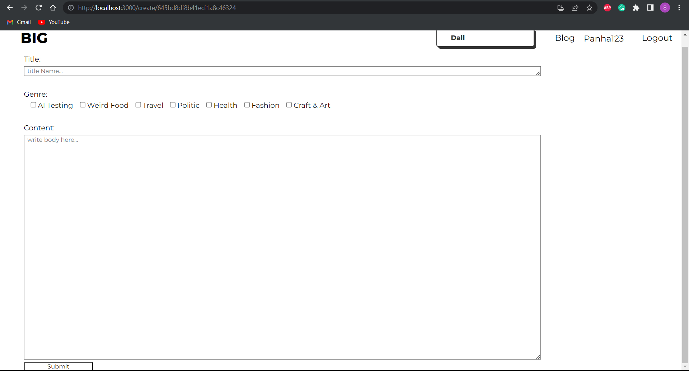

# BlogPost📝-FullStack:
A Full Stack BlogPost application (MVP). Built using Mern Tech Stack. you can register and login, with the help of JWT and Bcrypt, logining and register is secure🔒 the password is hash then store in database. The user is authenticated with cookies🍪. Onces you are login you can also published your own blog📰.
# Previews: 









# Tool Used 🛠️
### Back-end
> - [JWT](https://jwt.io/)
> - [RestFull api](https://restfulapi.net/)
> - [Bcrypt](https://www.npmjs.com/package/bcrypt)
> - [Express.js](https://expressjs.com/)
> - [Node.js](https://nodejs.org/en)
> - [MongoDB Atlas](https://www.mongodb.com/atlas/database)
> - [Moongose](https://mongoosejs.com/docs/guides.html)
> - [Cors](https://auth0.com/blog/cors-tutorial-a-guide-to-cross-origin-resource-sharing/)
> - [cookie-parser](https://www.npmjs.com/package/cookie-parser)
> - [dotenv](https://www.npmjs.com/package/dotenv)
### Front-End
> - [React.js](https://react.dev/)
> - [Axios](https://www.npmjs.com/package/axios)

**Server** will run on port `3001` by Default. The **Client** will run on port `3000` by Default

# How to Run Application 🏃
### Make sure you have: 
- `MongoDB Atlas` account with a [cluster](https://www.mongodb.com/basics/clusters/mongodb-cluster-setup)
- Have `JWTTokenSecrete`, generate one here: [random string](https://www.javainuse.com/jwtgenerator)
- Create a [.env](https://www.npmjs.com/package/dotenv) File in the server folder.
```.env
//.env File
DB_URI = *MongoDBLinkHere*
PORT = 3001
ACCESS_TOKEN_SECRET = *JWTTokenSecreteHere*
```

### Instruction:
* [Clone the Application](https://docs.github.com/en/repositories/creating-and-managing-repositories/cloning-a-repository)
* In the terminal `cd` to the server dir and type `npm start`
```shell
cd server
npm start
```
* In the terminal `cd` to the client dir and type `npm start`
```shell
cd client
npm start
```
